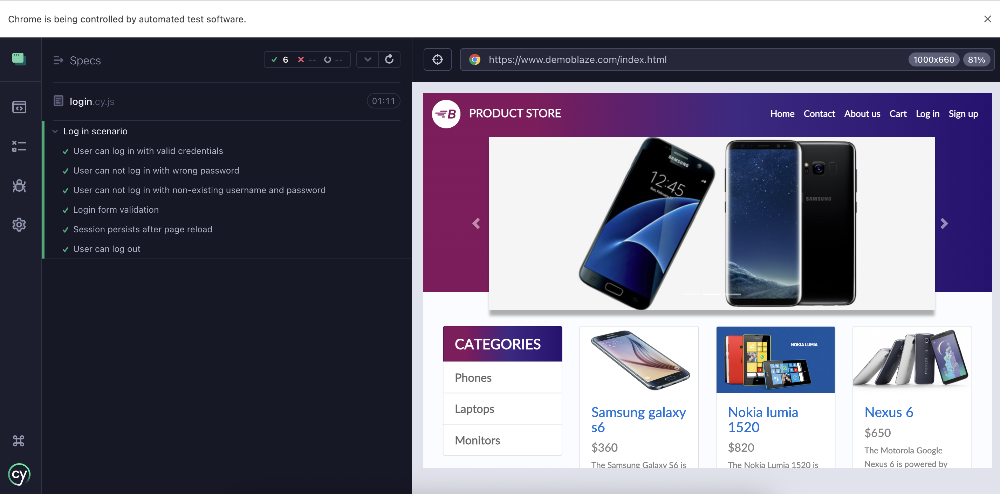

# Cypress tests for DemoBlaze store
This repository contains automated end-to-end tests for the [DemoBlaze](https://www.demoblaze.com/)  online store. The main focus is testing the login and purchase flow for buying a new laptop. The tests are implemented in JavaScript using [Cypress](https://www.cypress.io/).


## Project Overview
This project automates the critical flows of the DemoBlaze store:

* Logging in with valid and invalid credentials
* Adding a laptop to the shopping cart
* Completing the checkout process
* Verifying the order details and successful redirection

## Test approach
When designing these tests, the focus was on:
* **Core user journey** — a real customer buying a laptop from start to finish.
* **Positive and negative login scenarios** — to ensure security and correct error handling.
* **Data-driven approach** — customer details stored in fixtures for reusability.
* **Assertions at key steps** — to ensure correct UI behavior and data integrity.

The tests in this project follow the Page Object Model (POM) design pattern.
In POM, selectors and page-specific actions are stored in separate files (page objects) instead of being written directly in the test cases.


#### How it works here:

All page selectors are stored in `cypress/support/page/Selectors.js`. Tests import selectors and use them, which keeps the test code clean and easy to maintain.

#### Advantages of POM:

* Selectors and methods can be reused across multiple tests
* If a selector changes, it’s updated only in one place
* Tests focus on actions and validations, not on low-level selectors
* Easier to expand test coverage without duplicating code

#### Why are these tests essential?
* Login is the entry point for any authenticated actions.
* The purchase flow represents the most critical revenue-generating process. * Verifying order details ensures data consistency and trust in the application.

## Test scenarios
1. User can log in with valid credentials
2. User cannot log in with the wrong password
3. User cannot log in with non-existing username and password
4. Login form validation
5. Session persists after page reload
6. User can log out
7. E2E laptop purchase flow

## Installation
1. Clone the repository:
```
git clone https://github.com/helgatrue/cypress-demoblaze-tests.git
cd cypress-demoblaze-tests
```

2. Install dependencies:
```
npm install
```
3. Install the Cypress framework:
```
npm install cypress --save-dev
```

## Running the tests
Open Cypress in GUI mode to see the tests run step-by-step:
```
npx cypress open
```

or run them in console:
```
npx cypress run
```

On this screen, click on E2E Testing. Chrome browser is used by default:


On the following screen, you will see the test suites to run. You can select the one you want to try, and it will start its execution:


On the left, you will see a list of test cases and the status of each one:

